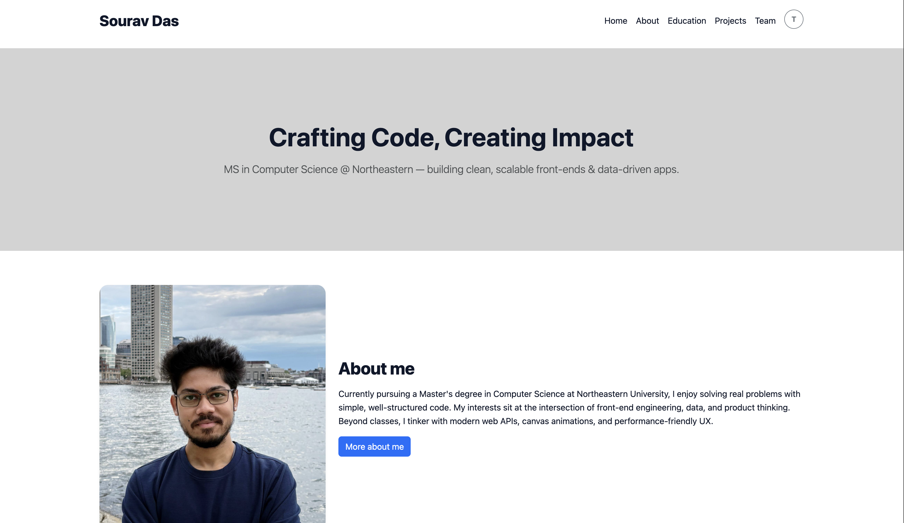
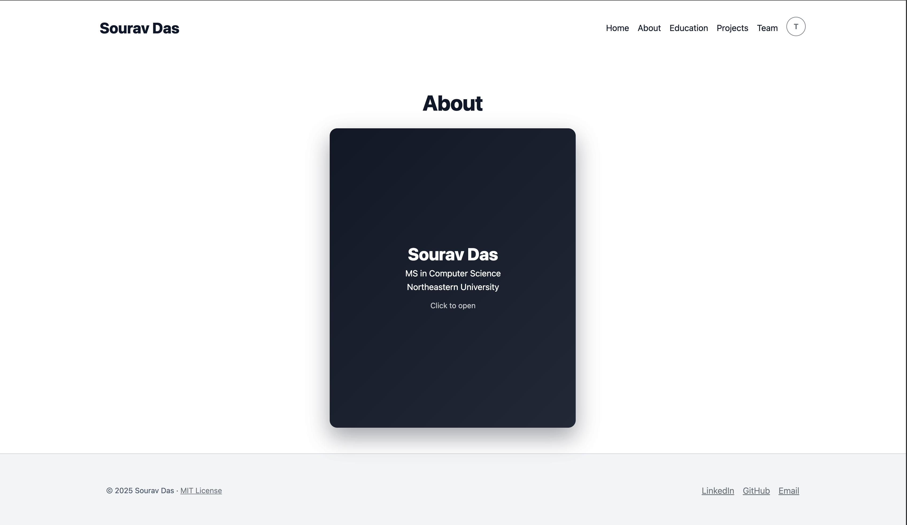
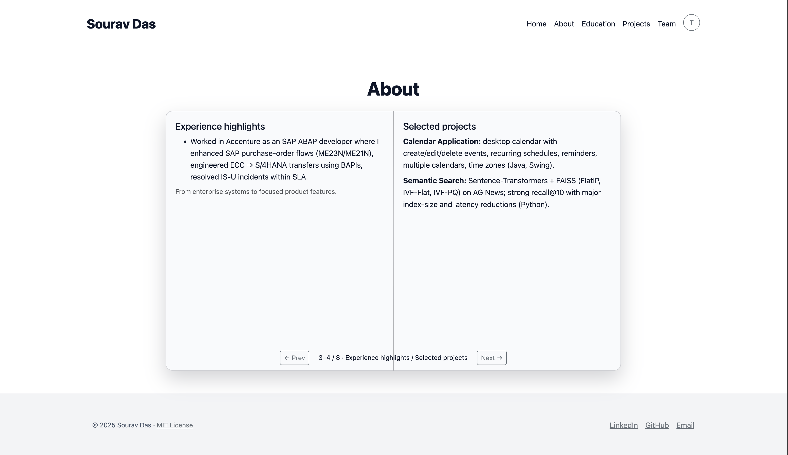
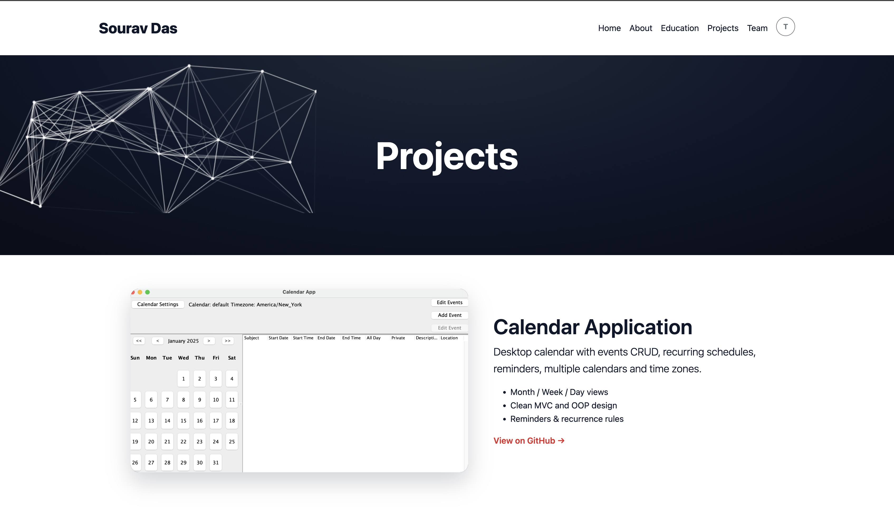
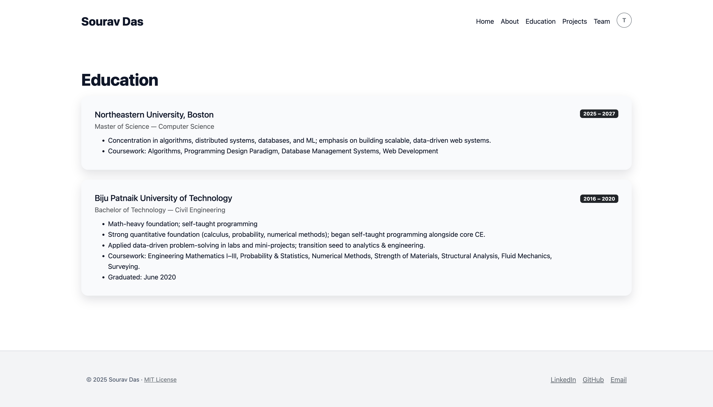
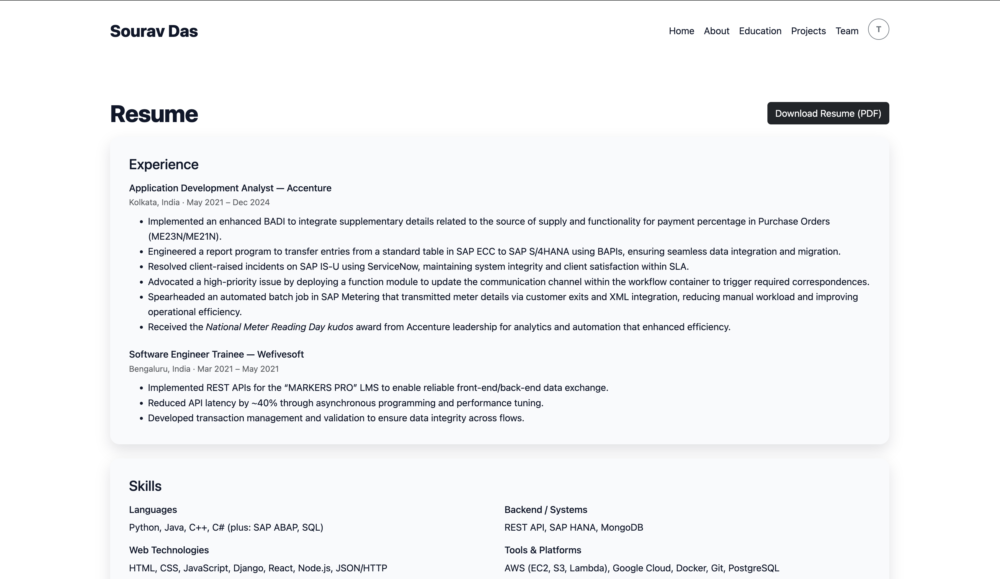
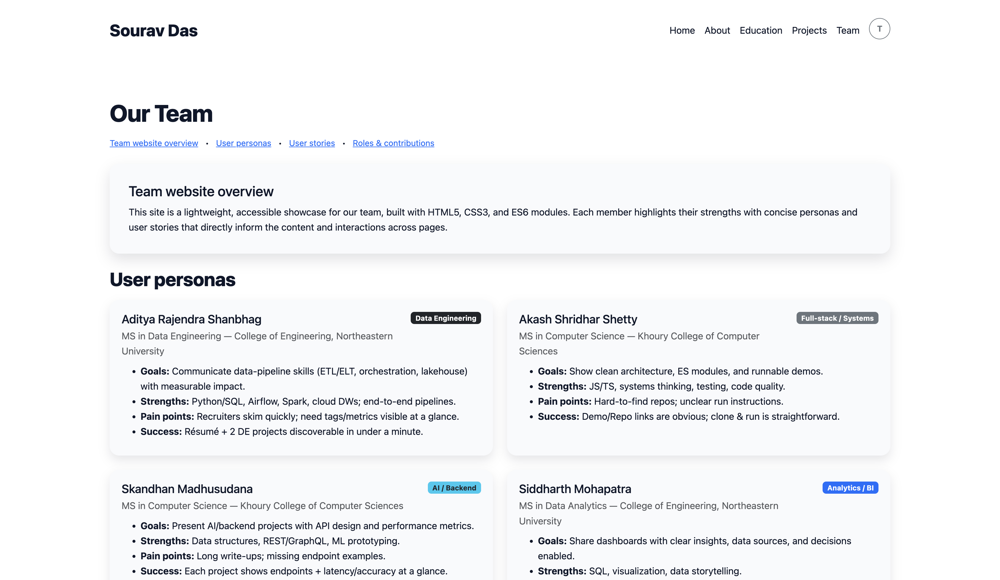

# Personal Homepage — Sourav Das

A fast, accessible, and elegant vanilla HTML5/CSS3/ES6 personal site.Uses Bootstrap 5 utilities only.
ESLint keeps the JS clean.

## Author
Author: Sourav Das
Course: CS5610
Tech stack: Vanilla HTML5/CSS3/ES6 modules, Bootstrap 5 (utilities only).
Unique JS: Interactive "Book" on About page (open + page flips), Particle header on Projects page, Reveal-on-scroll.

## Class Link

https://northeastern.instructure.com/courses/226004

## Project Objective
To showcase my background, projects, and resume with clean, semantic HTML; responsive, accessible CSS; and modular ES6 JavaScript. The site demonstrates original front‑end functionality (interactive About page 'flip‑book', 'particles' hero on Projects, reveal‑on‑scroll, theme toggle) while following course constraints (vanilla + Bootstrap 5, ES modules, ESLint).

## Sitepreview
assets/images/first_page.png

**Highlights**
- Interactive flip-book on About page (open + page flips).
- Canva Particle header on Projects page.
- Alternating image and text project bands (full-row link to GitHub).
- Theme toggle (circular 'T'), responsive layout, fixed footer.
- Meta + favicons included (author, description, 16/32/180 PNG icons).

---

## Tech Stack
- HTML5 + CSS3 (Bootstrap 5 utilities)
- ES6 modules (no bundler, no backend)
- ESLint (course config)
- License: MIT

---

## Folder Structure
```
assets/
  css/main.css
  js/main.js
  js/modules/...(header.js, footer.js, themeToggle.js, nav.js, revealOnScroll.js, particleHeader.js, flipBook.js)
  images/...
  icons/{favicon-16.png,favicon-32.png,sourav_icon.png}
  docs/Sourav_Das_Resume_Computer_Science.pdf
index.html       # Home
about.html       # Flip-book
projects.html    # Projects
resume.html      # Experience, Skills, Certifications (+ Download PDF)
education.html   # Degrees
team.html        # Personas & user stories
package.json     # type: module; eslint script
.eslintrc.*
LICENSE
README.md
```

---

# Instructions to Build / Run Locally
This is a static site—no build step required. Serve over HTTP so ES modules load correctly.

### 1) Clone
```bash
git clone <your-repo-url>.git
cd <your-repo-folder>
```

### 2) Install dev tools (optional: for linting)
```bash
npm install
```

### 3) Run a local server (choose one)
**Python**
```bash
python3 -m http.server 8080
# open http://localhost:8080/
```
**Node (temporary server)**
```bash
npx serve .
# or: npx http-server .
```

### 4) Lint (optional, recommended)
```bash
npm run lint
# or auto-fix:
npx eslint assets/js --ext .js --fix
```

## Deploy
- GitHub Pages: Settings → Pages → *Deploy from a branch* → `main` / root (`/`); publish.  
- Netlify/Cloudflare Pages: Set publish directory to repo root; drag‑and‑drop or connect repo.
---

### About Flip-Book
Edited in pages inside the `about.html`.  
Behavior lives in `assets/js/modules/flipBook.js` (open + flips).


### Meta & Icons (every page `<head>`)
```html
<meta name="author" content="Sourav Das" />
<meta name="description" content="Sourav Das — portfolio, projects and resume." />
<link rel="icon" href="./assets/icons/favicon-32.png" sizes="32x32" type="image/png" />
<link rel="icon" href="./assets/icons/favicon-16.png" sizes="16x16" type="image/png" />
<link rel="apple-touch-icon" href="./assets/icons/apple-touch-icon.png" />
<meta name="theme-color" content="#0f172a" />
```

---

## Accessibility & Performance
- Keyboard-friendly (book supports ← →), visible focus styles.
- Contrast checked; dark theme uses readable `--secondary-fg`.
- Decorative canvases are `aria-hidden="true"`.
- Target Lighthouse: Perf ≥ 90 · SEO ≥ 90 · A11y ≥ 95.

---

## Troubleshooting
- 'ES modules fail to load' → serve via HTTP.  
- 'ESLint missing' → `npm install` then `npm run lint`.  
- 'Strings must use double quote' → use `"double"` in JS or run `--fix`.  
- 'Particles not visible' → only on `projects.html`; ensure `<canvas id="projects-canvas">` exists.

---

## AI used to create the 'project.html' page

- Tool: OpenAI ChatGPT — GPT-5 Thinking
- Context: Used for guidance, ideation and troubleshoot purpose.
- Prompt1(to make the project.html page) - "I have 3 project entries. Teach me how to rearrange in a web page. I am planning to keep it like image | text, then text | image, then image | text. Do not provide any code. Just teach me how to do this in words.
- Prompt2(animated particle header) - "Teach me how to build a particle or start 'constellation' animated header in 
vanilla JS. Explain the structure how to create the first HTML and then the minimal JS."

---
Screenshots

<p align="center">
  
</p>

<p align="center">
  
</p>

<p align="center">
  
</p>

<p align="center">
  
</p>

<p align="center">
  
</p>

<p align="center">
  
</p>

<p align="center">
  
</p>

---

## License
MIT — see `LICENSE`.
